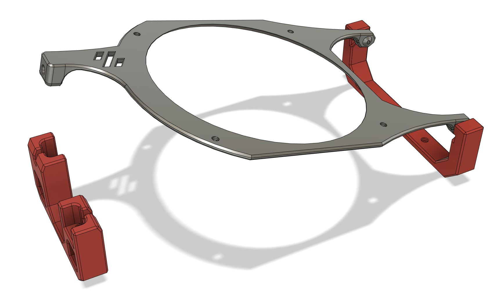
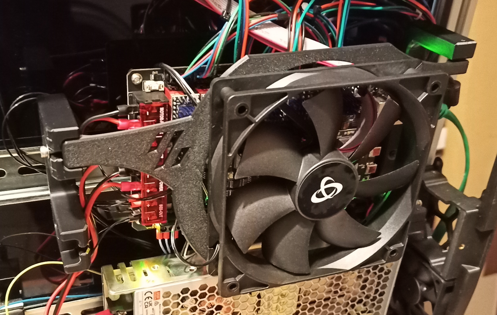
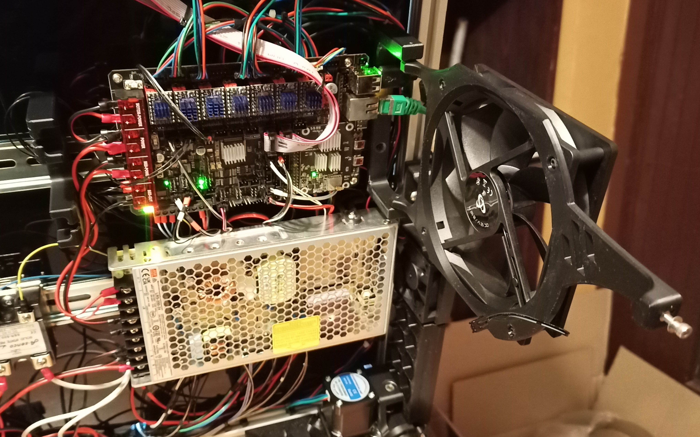
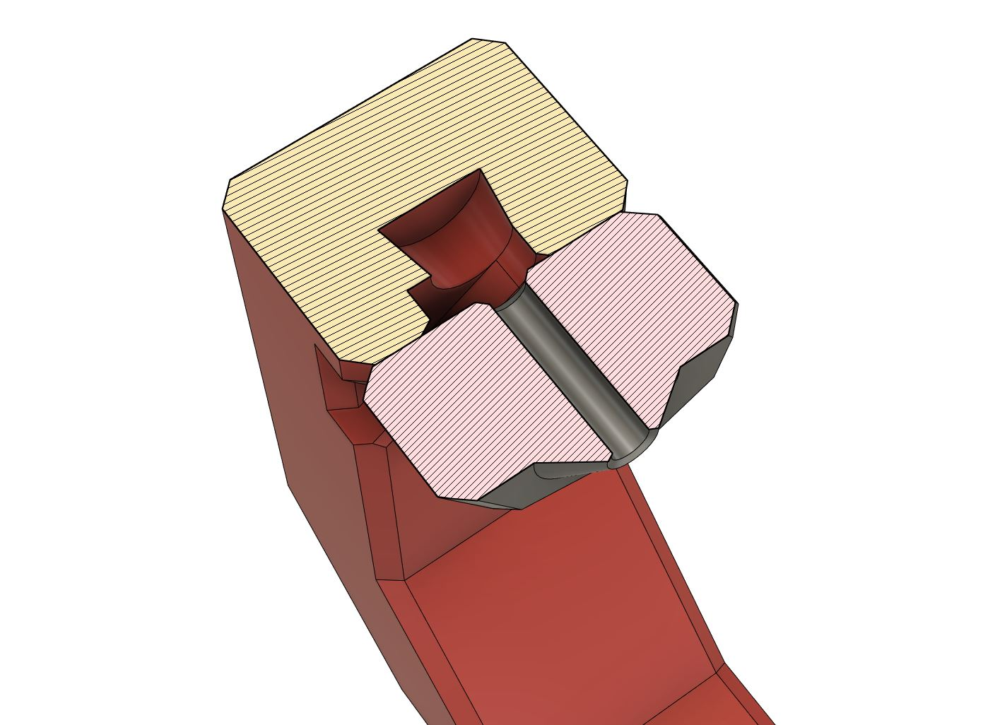

# Removable Electronics Fan

## Print settings
* 0.4 nozzle (100% line width, so 0.4)
* layer height: 0.2 
* top/bottom layers: at least 5 for the fan plate, 3-4 for the rest
* walls: at least 4 for the plate, 3-4 for the rest 
* infill: 40% for the plate, 20% for the rest
* no supports, they are built in
* filament: any normal structural material will do

Adjust your settings if needed based on your preferred print setup.

## BOM
* 6 x M2 10mm self-tapping
* 1 x M3 10mm and up
* 1 x M3 heat insert

## Assembly

