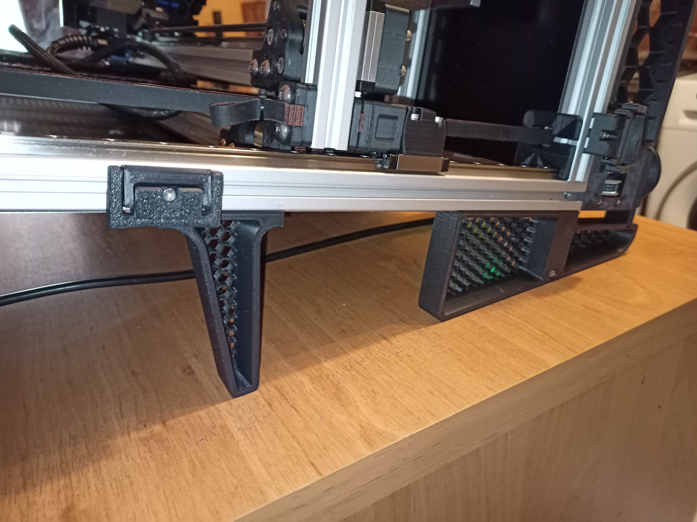
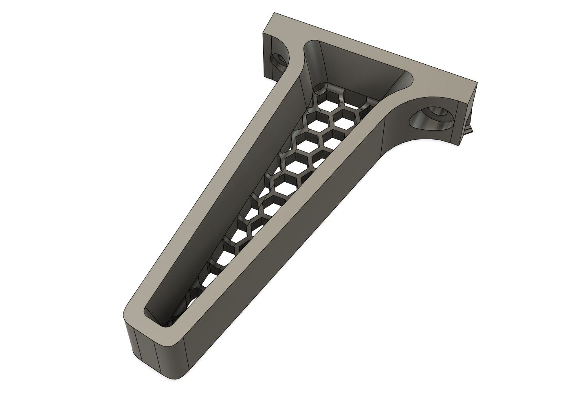
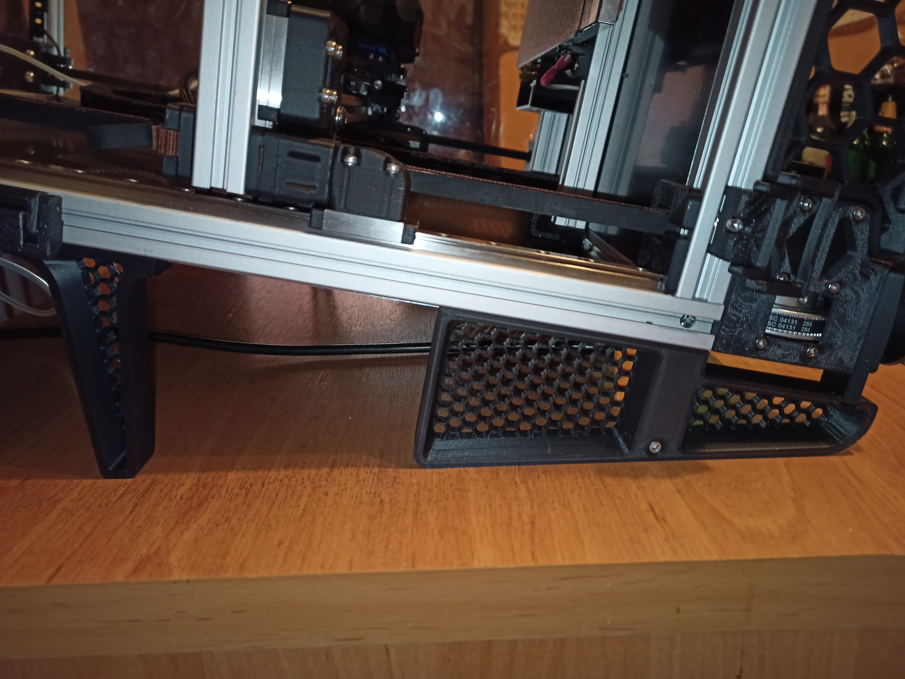

# RockNRoll Mod Stilts
Intended for use with Voron printers that use the awesome
[RockNRoll mod](https://github.com/VoronDesign/VoronUsers/tree/master/printer_mods/RockNLol/RockNRoll)
by RockNLol. This stops the printer from tipping over if the center of mass is a
bit higher.

## Print settings
I used the settings recommended in the original mod, so:

* 0.4 nozzle (100% line width, so 0.4)
* 0.2 layer height
* 10 top/bottom layers
* 5 walls
* 40% infill
* no supports, they are built in
* filament: any normal structural material will do

Adjust your settings if needed based on your preferred print setup.

## BOM
* 2 x M5 10mm BHCS or SHCS with shim
* 2 x M3 10 or 12mm BHCS or SHCS with shim
* 2 x M5 T-nut
* 2 x M3 'hammerhead' or T-nut

## Assembly
Bolt them on to the center of the back extrusion, but don't tighten. Tilt the
printer back carefully and adjust the position so that the rockers are flat on
the surface. Position both stabilizers so that they both have about equal
pressure on them.

